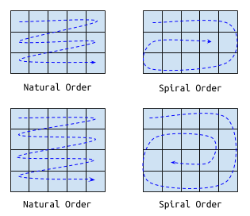

**Matrix Spiralizer**

Matrix Spiralizer
===

## Overview

Given an `m x n` matrix of `int`s, implement a method that returns a new matrix with the contents that are a "spiralized" version of the original matrix.

What we will call the "natural order" is one that involves reading a matrix row-by-row starting with the top row. The "spiral order" keeps the first row unchanged but then the subsequent elements follow a spiral, with the last element in the original matrix (the element at the bottom right) becoming the innermost element in a spiral. (The figure below has two examples of the natural vs. sprial order.)

## Your Task

In the Java class `MatrixSpiralizer`, implement the method `int[][] spiralize(int[][])` that returns a matrix of identical dimensions to the input matrix, but with the contents in spiral order. Your implementation should account for matrices of different sizes and should handle corner cases as well (`0 x 0` matrices and `1 x 1` matrices, for example).

## Examples

The matrix

| 1   | 2   | 3   |
|:---:|:---:|:---:|
| 4    | 5    | 6    |
| 7    | 8    | 9    |

would become

| 1    | 2    | 3    |
|:---:|:---:|:---:|
| 8    | 9    | 4    |
| 7    | 6    | 5    |

after spiralizing.

The matrix

| 7    | 5    | 1    | 4    | 6    |
|:---:|:---:|:---:|:---:|:---:|
| 3    | 2    | 9    | 1    | 8    |
| 8    | 3    | 2    | 4    | 1    |
| 10   | 11   | 15   | 19   | 14   |

would become

| 7    | 5    | 1    | 4    | 6    |
|:---:|:---:|:---:|:---:|:---:|
| 4    | 1    | 10   | 11   | 3    |
| 2    | 14   | 19   | 15   | 2    |
| 3    | 8    | 8    | 1    | 9    |

after spiralizing.
